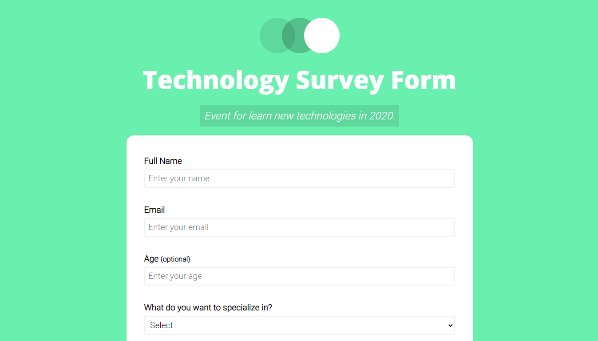

<h1 align="center">💻 SurveyFormCSS 🖌</h1>

💚 <b>Beautiful modern-style Form</b> 📗

<a href="https://360macky.github.io/SurveyFormCSS/" target="_blank">✅ Just go to the page! 🚀</a> 

This project was created as a Responsive Web Design project in [freeCodeCamp](https://freecodecamp.org/).
